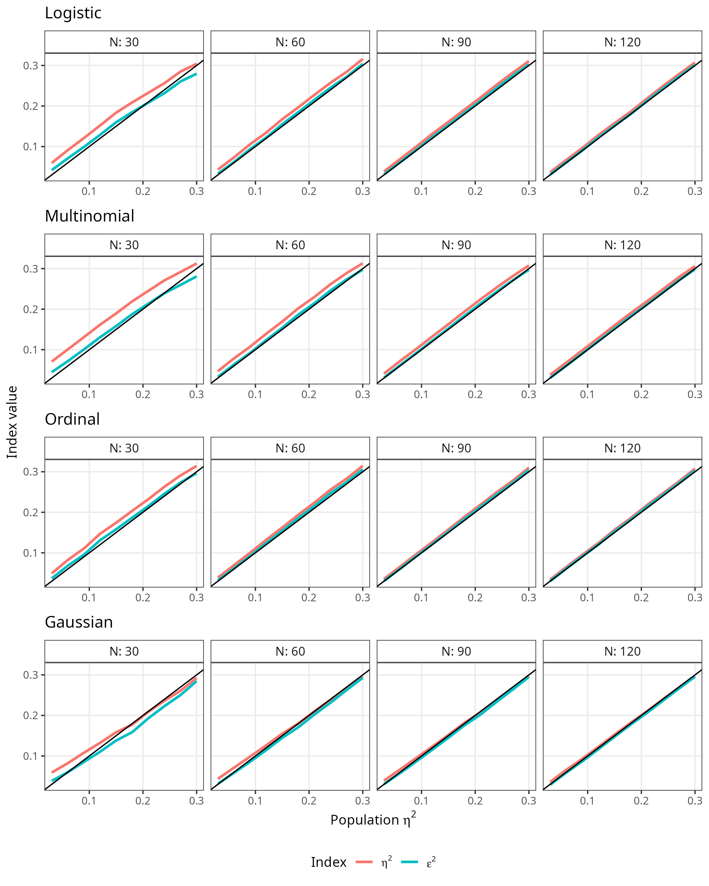
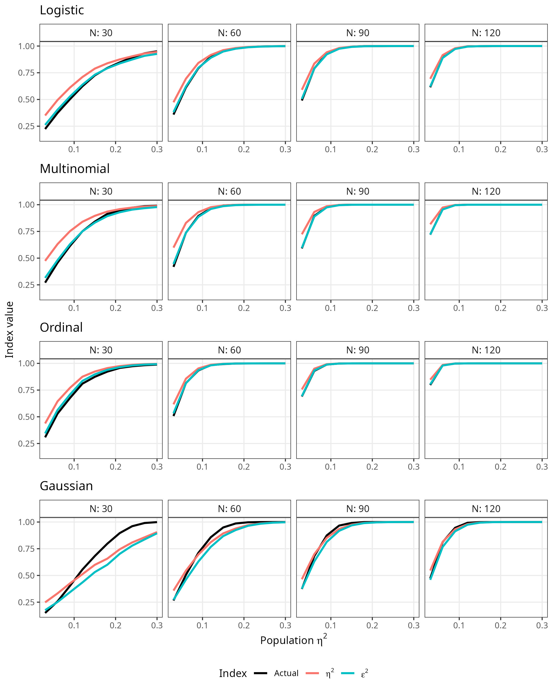

```{r setup, include=FALSE}
knitr::opts_chunk$set(echo = TRUE)
```

## Simulation results tables

The figures in the main text plot the results of Study 1 (recovery of the whole-model R^2^ and of a single focal predictor's eta-squared) and Study 2 (simulation-based required sample size). For Study 1, each Model x N x k combination in the figures is a
curve over 10 population effect size values; the tables below summarize accuracy and power collapsed across those population effect size values only (mean signed bias, mean absolute bias, RMSE, and mean power gap, by model, sample size, and number of covariates k), keeping the k = 3 vs. k = 5 conditions separate rather than averaging over them, so the full crossed design is preserved -- the full per-point results are available in this repository's `simulations/Data/` folder. For Study 2, which has no sample-size or k dimension, the tables report the full underlying data.

```{r results-setup, include=FALSE}
library(kableExtra)
source("../simulations/functions.R")   # theoretical_power(), focal_df(), model_labels

load("../simulations/Data/study1.a.data.Rdata")   # -> `results` (Study 1a, R^2 design)
study1a <- results

load("../simulations/Data/study1.b.data.Rdata")   # -> `results` (Study 1b, eta^2 design)
study1b <- results

e <- new.env(); load("../simulations/Data/study2.a.data.Rdata", envir = e); study2a <- e$results
e <- new.env(); load("../simulations/Data/study2.b.data.Rdata", envir = e); study2b <- e$results

study1a$power_r2    <- mapply(theoretical_power, study1a$er2,  study1a$N, study1a$k, study1a$model)
study1a$power_adjr2 <- mapply(theoretical_power, study1a$aer2, study1a$N, study1a$k, study1a$model)

study1b$df_test <- sapply(study1b$model, focal_df)
suppressMessages({
  study1b$power_eta2    <- mapply(theoretical_power, study1b$eeta2,  study1b$N, study1b$k, study1b$model, study1b$df_test)
  study1b$power_adjeta2 <- mapply(theoretical_power, study1b$aeeta2, study1b$N, study1b$k, study1b$model, study1b$df_test)
})

long_table <- function(data, cols, names, order_cols, digits, caption) {
  data$Model <- factor(model_labels[data$model], levels = model_labels)
  tab <- data[do.call(order, data[, c("Model", order_cols)]), c("Model", cols)]
  colnames(tab) <- c("Model", names)
  rownames(tab) <- NULL
  kbl(tab, digits = digits, booktabs = TRUE, longtable = TRUE, caption = caption,
      linesep = c(rep("", 7), "\\addlinespace")) %>%
    kable_styling(latex_options = c("repeat_header", "hold_position"), font_size = 8)
}

## Collapse a Study 1 data set across its 10 population-effect-size values only, giving
## one row per Model x N x k cell -- 32 rows total, vs. 320 in the full per-point data.
## k is kept as its own column (not averaged over), so the full crossed design shows.
agg_table <- function(data, formula, names, digits, caption) {
  data$model_label <- factor(model_labels[data$model], levels = model_labels)
  tab <- aggregate(formula, data = data, FUN = mean)
  tab <- tab[order(tab$model_label, tab$N, tab$k), ]
  colnames(tab) <- c("Model", "N", "k", names)
  rownames(tab) <- NULL
  kbl(tab, digits = digits, booktabs = TRUE, longtable = TRUE, caption = caption,
      linesep = c(rep("", 7), "\\addlinespace")) %>%
    kable_styling(latex_options = c("repeat_header", "hold_position"), font_size = 9)
}

study1a$power_gap_r2    <- abs(study1a$power_r2    - study1a$power)
study1a$power_gap_adjr2 <- abs(study1a$power_adjr2 - study1a$power)

study1b$power_gap_eta2 <- abs(study1b$power_eta2    - study1b$power)
study1b$power_gap_eps2 <- abs(study1b$power_adjeta2 - study1b$power)
```

### Study 1a: accuracy of R^2^ (collapsed summary of Figure 1)

```{r table-figure1, echo=FALSE}
agg_table(study1a,
          cbind(bias_r2 = bias, abs_bias_r2 = abs(bias), rmse_r2 = rmse,
                bias_adjr2 = abias, abs_bias_adjr2 = abs(abias), rmse_adjr2 = armse) ~ model_label + N + k,
          c("Bias (R2)", "Mean |Bias| (R2)", "RMSE (R2)",
            "Bias (Adjusted R2)", "Mean |Bias| (Adjusted R2)", "RMSE (Adjusted R2)"),
          digits = 3,
          caption = "Accuracy of R2 and adjusted R2, by model, N, and number of covariates k, collapsed across population R2 (data underlying Figure 1). Bias columns report the mean signed bias, so the direction of the deviation is preserved.")
```

### Study 1a: power of the omnibus test (collapsed summary of Figure 3)

```{r table-figure3, echo=FALSE}
agg_table(study1a,
          cbind(power_gap_r2, power_gap_adjr2) ~ model_label + N + k,
          c("Mean Power Gap (R2)", "Mean Power Gap (Adjusted R2)"),
          digits = 3,
          caption = "Mean |simulated - closed-form| power for R2 and adjusted R2, by model, N, and number of covariates k, collapsed across population R2 (data underlying Figure 3).")
```

### Study 1b: accuracy of eta-squared (collapsed summary of Figure 2)

```{r table-figure2, echo=FALSE}
agg_table(study1b,
          cbind(bias_eta2 = bias, abs_bias_eta2 = abs(bias), rmse_eta2 = rmse,
                bias_eps2 = abias, abs_bias_eps2 = abs(abias), rmse_eps2 = armse) ~ model_label + N + k,
          c("Bias (Eta2)", "Mean |Bias| (Eta2)", "RMSE (Eta2)",
            "Bias (Epsilon2)", "Mean |Bias| (Epsilon2)", "RMSE (Epsilon2)"),
          digits = 3,
          caption = "Accuracy of eta-squared and adjusted epsilon-squared, by model, N, and number of covariates k, collapsed across population eta-squared (data underlying Figure 2). Bias columns report the mean signed bias, so the direction of the deviation is preserved. Because the sign of the epsilon-squared bias reverses across effect sizes for some models (see main text), collapsed signed values can be close to zero; per-effect-size values are available in the repository's simulations/Data folder.")
```

### Study 1b: power of the single-predictor test (collapsed summary of Figure 4)

```{r table-figure4, echo=FALSE}
agg_table(study1b,
          cbind(power_gap_eta2, power_gap_eps2) ~ model_label + N + k,
          c("Mean Power Gap (Eta2)", "Mean Power Gap (Epsilon2)"),
          digits = 3,
          caption = "Mean |simulated - closed-form| power for eta-squared and epsilon-squared, by model, N, and number of covariates k, collapsed across population eta-squared (data underlying Figure 4).")
```

## Supplementary simulation: nonzero effects for the other covariates

In the $\eta^2$ simulations reported in the main text (Study 1b), the focal predictor was the only covariate with a nonzero population coefficient; the remaining $k-1$ covariates were correlated with it (r = .30) but had no true effect on the outcome. To check that this design choice does not flatter the indices -- with the nuisance coefficients at zero, the reduced model used to compute $\eta^2$ is close to the null model, so the deviance comparison underlying the index is not exercised in its more general, nontrivial form -- Study 1b was rerun with the $k-1$ nuisance covariates given a real, nonzero effect: half the magnitude of the focal predictor's coefficient: `Rsimcity::sample_by_eta2()` rescales the whole coefficient vector to hit the target $\eta^2$ for the focal predictor exactly, so this pattern preserves the intended population $\eta^2$ while making the covariates relevant to the outcome. Models, sample sizes, population $\eta^2$ values, covariate correlation, exclusion criteria, and the 5,000 replications per cell are identical to
Study 1b; Since number of covariates did not influence the results, only $k=3$ was run in this supplementary simulation.

```{r figure-sup1, echo=FALSE, fig.cap="Estimated eta-squared and adjusted epsilon-squared against the population eta-squared, in the supplementary simulation with nonzero nuisance-covariate effects. Black lines represent the population effect size value.", fig.height=10, fig.width=8, out.width="70%", fig.align='center'}

```

```{r figure-sup2, echo=FALSE, fig.cap="Power estimates for the LR test of the focal predictor based on eta-squared and adjusted epsilon-squared, in the supplementary simulation with nonzero nuisance-covariate effects. Actual represents the empirical power computed in the simulated samples.", fig.height=10, fig.width=8, out.width="70%", fig.align='center'}

```

```{r table-sup-setup, include=FALSE}
e <- new.env(); load("../simulations/Data/study1.b.supp.data.Rdata", envir = e); study1bsupp <- e$results
study1bsupp$k <- 3

study1bsupp$df_test <- sapply(study1bsupp$model, focal_df)
suppressMessages({
  study1bsupp$power_eta2    <- mapply(theoretical_power, study1bsupp$eeta2,  study1bsupp$N, study1bsupp$k, study1bsupp$model, study1bsupp$df_test)
  study1bsupp$power_adjeta2 <- mapply(theoretical_power, study1bsupp$aeeta2, study1bsupp$N, study1bsupp$k, study1bsupp$model, study1bsupp$df_test)
})
study1bsupp$power_gap_eta2 <- abs(study1bsupp$power_eta2    - study1bsupp$power)
study1bsupp$power_gap_eps2 <- abs(study1bsupp$power_adjeta2 - study1bsupp$power)

## Baseline (k = 3 subset, nuisance beta = 0) vs. supplementary (nuisance beta = .5 x
## focal) condition, collapsed across the 10 population eta-squared values -- 32 rows
## (Model x N) per condition.
study1b_k3 <- study1b[study1b$k == 3, ]
study1b_k3$condition   <- "Nuisance = 0"
study1bsupp$condition  <- "Nuisance = .5x focal"
cond_cols <- c("model", "N", "k", "bias", "abias", "rmse", "armse", "power_gap_eta2", "power_gap_eps2", "condition")
cond_data <- rbind(study1b_k3[, cond_cols], study1bsupp[, cond_cols])
cond_data$model_label <- factor(model_labels[cond_data$model], levels = model_labels)
cond_data$condition   <- factor(cond_data$condition, levels = c("Nuisance = 0", "Nuisance = .5x focal"))

cond_table <- function(data, formula, names, digits, caption) {
  tab <- aggregate(formula, data = data, FUN = mean)
  tab <- tab[order(tab$model_label, tab$N, tab$condition), ]
  colnames(tab) <- c("Model", "N", "Condition", names)
  rownames(tab) <- NULL
  kbl(tab, digits = digits, booktabs = TRUE, longtable = TRUE, caption = caption,
      linesep = c("", "\\addlinespace")) %>%
    kable_styling(latex_options = c("repeat_header", "hold_position"), font_size = 8)
}
```

### Accuracy of eta-squared and epsilon-squared, with and without nonzero nuisance effects

```{r table-sup-accuracy, echo=FALSE}
cond_table(cond_data,
           cbind(bias_eta2 = bias, abs_bias_eta2 = abs(bias), rmse_eta2 = rmse,
                 bias_eps2 = abias, abs_bias_eps2 = abs(abias), rmse_eps2 = armse) ~ model_label + N + condition,
           c("Bias (Eta2)", "Mean |Bias| (Eta2)", "RMSE (Eta2)",
             "Bias (Epsilon2)", "Mean |Bias| (Epsilon2)", "RMSE (Epsilon2)"),
           digits = 3,
           caption = "Accuracy of eta-squared and epsilon-squared, by model and N, comparing the main-text condition (nuisance covariates with zero effect) against the supplementary condition (nuisance covariates at half the focal coefficient), collapsed across population eta-squared, k = 3 only.")
```

### Power of the single-predictor test, with and without nonzero nuisance effects

```{r table-sup-power, echo=FALSE}
cond_table(cond_data,
           cbind(power_gap_eta2, power_gap_eps2) ~ model_label + N + condition,
           c("Mean Power Gap (Eta2)", "Mean Power Gap (Epsilon2)"),
           digits = 3,
           caption = "Mean |simulated - closed-form| power for eta-squared and epsilon-squared, by model and N, comparing the main-text condition (nuisance covariates with zero effect) against the supplementary condition (nuisance covariates at half the focal coefficient), collapsed across population eta-squared, k = 3 only.")
```

Across every model and sample size, accuracy and power under the nonzero-nuisance condition are essentially unchanged from the main-text condition: mean absolute bias in $\eta^2$ and $\epsilon^2$ differs by at most a few thousandths, and the direction and approximate magnitude of the $\epsilon^2$ bias-correction pattern described in the main text is preserved. The mean power gap for $\epsilon^2$ is somewhat larger under nonzero nuisance effects (`r round(mean(study1bsupp$power_gap_eps2), 3)` vs.
`r round(mean(study1b_k3$power_gap_eps2), 3)` in the main-text condition) but remains small in absolute terms. These results support treating the main-text $\eta^2$ simulation design as a reasonable proxy for the more general case in which the other covariates also have non-zero effects.

### Study 2: required sample size (data underlying Figure 5)

```{r table-figure5-omnibus, echo=FALSE}
long_table(study2a, c("r2", "N", "Nt"),
           c("Population R2", "Required N (Simulated)", "Required N (Closed-form)"),
           order_cols = "r2", digits = 3,
           caption = "Required sample size for 80\\% power, omnibus test: simulated vs. closed-form.")
```

```{r table-figure5-individual, echo=FALSE}
long_table(study2b, c("eta2", "N", "Nt"),
           c("Population Eta2", "Required N (Simulated)", "Required N (Closed-form)"),
           order_cols = "eta2", digits = 3,
           caption = "Required sample size for 80\\% power, single-predictor test: simulated vs. closed-form.")
```
